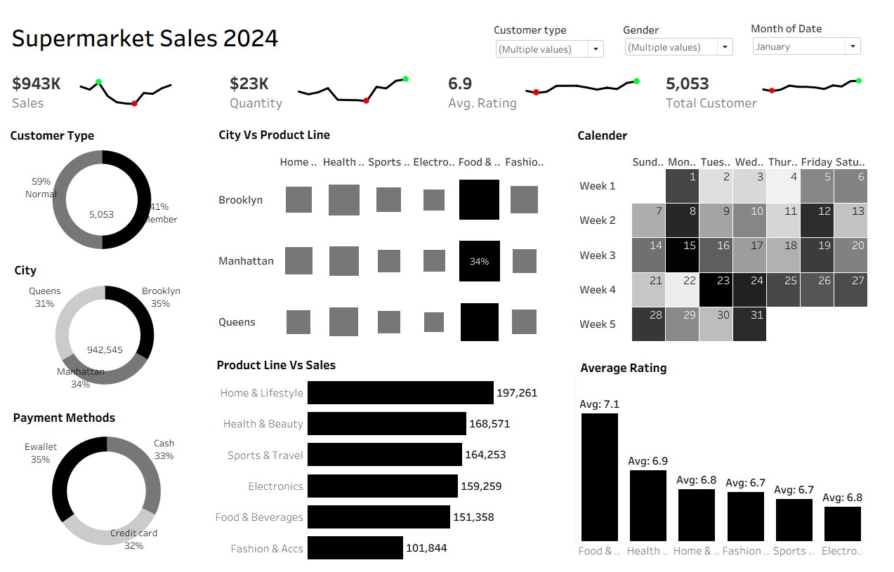

# 🛒 Supermarket Sales Analysis (Tableau)

This project is a **Tableau dashboard** built to analyze one year of supermarket sales data.  
The dashboard provides insights into **sales performance, customer behavior, product trends, and ratings** using interactive visualizations.

---

## 📊 Project Overview

The goal of this project is to:
- Analyze overall sales and customer performance
- Understand product-wise and city-wise trends
- Identify customer preferences and payment behavior
- Present insights using clean and interactive Tableau visuals

---

## 🧾 Dataset Details

The dataset is in **Excel format** and contains one year of supermarket transaction data.

### Columns Used:
- `Date` – Transaction date (1 year data)
- `Branch` – City / Branch location
- `Customer Type` – Member / Normal
- `Gender` – Male / Female
- `Product Line` – Product category
- `Unit Price` – Price per unit
- `Quantity` – Number of items sold
- `Payment` – Payment method (Cash, Credit Card, E-wallet)
- `Rating` – Customer rating

---

## 📌 KPIs Created

The dashboard includes the following **Key Performance Indicators (KPIs)**:
- **Total Sales**
- **Total Quantity Sold**
- **Average Customer Rating**
- **Total Number of Customers**

---

## 📈 Visualizations Used

### 1. KPI Cards
- Display overall business performance at a glance

### 2. Pie Charts
- **Customer Type Distribution**
- **City-wise Sales Distribution**
- **Payment Method Distribution**

### 3. Heatmap
- **City vs Product Line Analysis**
- Helps identify top-performing product categories by city

### 4. Bar Chart
- **Product Line vs Sales**
- Shows sales contribution of each product category

### 5. Calendar View
- Monthly calendar to analyze daily sales trends

### 6. Bar Chart
- **Average Rating by Product Line**
- Helps understand customer satisfaction across categories
---

## 📬 Contact

Created by **Devang Munjani**  
Feel free to connect or give feedback 😊
